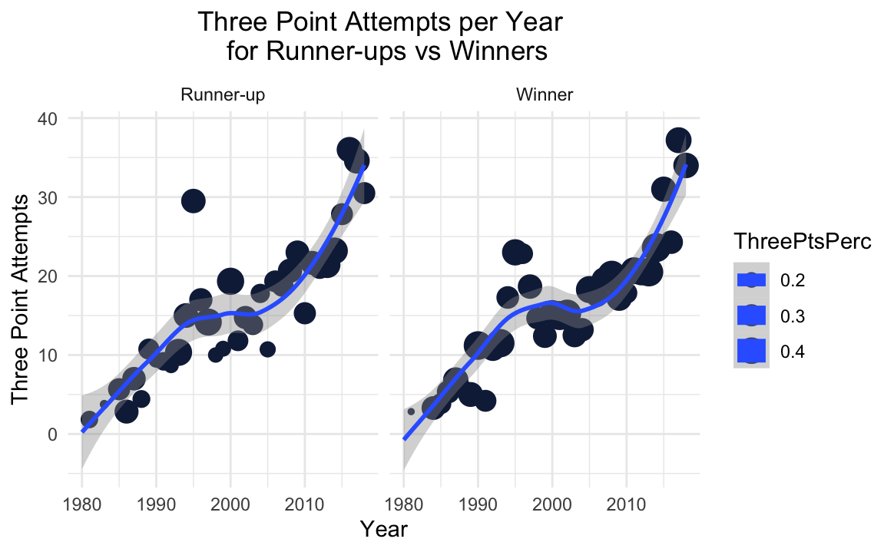
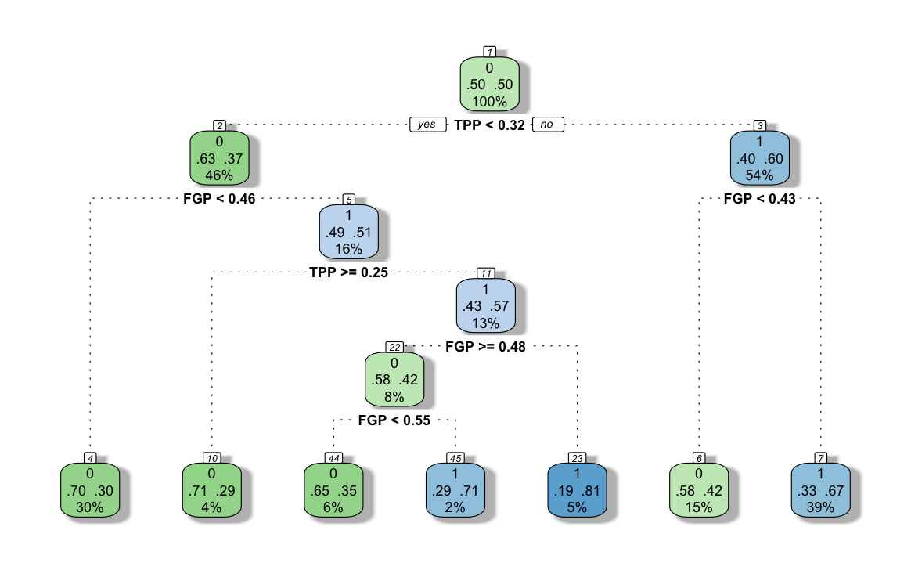

How does the current NBA look like compared to the NBA over time?
<!--more-->

## Authors: Vu, Praneeth, M
## Research Question

## How does the current NBA look like compared to the NBA over time?
# Set up:

# Opening libraries
```r
rm(list = ls())
# Data manipulation libraries
library(lubridate)
library(tidyverse)
library(dplyr)
# Plotting
library(ggplot2)
library(rattle)
# Machine Learning libraries
library(rpart.plot)
library(RColorBrewer)
``` 

## Data Intake:

```r
# Reading in the data
champ <- read.csv("./championsdata.csv")
runnerups <- read.csv("./runnerupsdata.csv")
nba_team <- read.csv("./NBA_Team_Stats.csv")
historical <- read.csv("./Historical_NBA_Performance.csv")
DefRating <- read.csv("./NBA_Defensive_Ratings.csv")
```

## Data Cleanup:

```r
# Filtering out the empty values, and pulling out the first 4 columns
historical <- historical[1:4]
historical <- historical %>% na.omit()
# Shortening every season name to only include the first year
season <- DefRating$SEASON
season <- as.numeric(substr(season, 1, 4))
DefRating$SEASON <- season 
# Renaming the defensive rating variable
def_rating <- DefRating$DEF.RTG
DefRating$def_rating <- def_rating
DefRating <- DefRating %>% select(-7)
# Calculate average defensive rating per season
DefRatingAvg <-
  DefRating %>%
  group_by(SEASON) %>%
  summarise(defratingSeasonAvg = sum(def_rating)/n())
```
`summarise()` ungrouping output (override with `.groups` argument)

```r
# Renaming another variable
rating_Vs_League_Avg <- DefRating$RTG.vs..LEAGUE.AVG
DefRating$rating_Vs_League_Avg<- rating_Vs_League_Avg
DefRating <- DefRating %>% select(-7)
```
```r
# Making the final datasets from merging two tables, champ and runner-ups
Result <- "Winner"
champ <- cbind(champ,Result)

Result <- "Runner-up"
runnerups <- cbind(runnerups, Result)

FinalsGames = champ %>%
  full_join(runnerups,by=c('Year','Team','Game','Win','Home','MP','FG','FGA','FGP','TP','TPA','TPP','FT','FTA','FTP','ORB','DRB','TRB','AST','STL','BLK','TOV','PF','PTS','Result'))

# Finding average points scored each year
AveragePoints <-
  FinalsGames %>%
  group_by(Year,Result) %>%
  summarise(AveragePTS=(sum(PTS)/n()))
```
`summarise()` regrouping output by 'Year' (override with `.groups` argument)

```r
# Finding average three point attempts and three point percentage per year
ThreePointsStat <-
  FinalsGames %>%
  group_by(Year, Result) %>%
  summarise(ThreePtsAttempt=(sum(TPA)/n()),
            ThreePtsPerc=(sum(TPP)/n()))
```
`summarise()` regrouping output by 'Year' (override with `.groups` argument)

```r
# Comparing the average three point attempts from the winner teams with the runner-up teams in the NBA Finals from 1980 to 2018
ThreePtsCompare <-
  ThreePointsStat %>%
  select(Year,Result,ThreePtsAttempt) %>%
  pivot_wider(names_from=Result, values_from=ThreePtsAttempt)
```

## Examine Data Source:

The origin of our data was from a Website knows as Kaggle. The website is known for having a huge compilation of datasets, in order for people to learn data science.There are 4 data tables that we are currently working with. The four tables are Champion data, runner-up data, historical NBA data, and NBA team data. The data was collected from stats of past games that the NBA collects and has collected since its inception.

The [Champion Table](https://www.kaggle.com/datasets/daverosenman/nba-finals-team-stats?fbclid=IwAR0xY43tZSQhqZmvXEbxQ9jKOMPHSuu45_yUR00DpdGOJxei53C71hHRbW0&select=runnerupsdata.csv) is data about the championship winning teams from 1980 to 2018. It looks at variables such as Field Goals, wins, free throw percentage, and more.

The [Runner-Up Data](https://www.kaggle.com/datasets/daverosenman/nba-finals-team-stats?fbclid=IwAR0xY43tZSQhqZmvXEbxQ9jKOMPHSuu45_yUR00DpdGOJxei53C71hHRbW0&select=runnerupsdata.csv) includes the same 24 variables and number of cases as the champions data, but this cases are for the the yearly runner-up.

The third table is the tables on [NBA Team Data](https://data.world/etocco/nba-team-stats/workspace/file?filename=NBA_Team_Stats.csv&fbclid=IwAR2mGDFc5c1p6RGYt3O-iwfBn6l92Y5BOFW0Jslxhz_28V3yus6gZf_iUuA). It has 22 variables ranging from points to year. This data is for every NBA regular season for each team from 1997 to 2021.

The final table is the table on historical team data [Historical Team Data](https://data.world/gmoney/nba-team-records-by-year/workspace/file?filename=Historical%20NBA%20Performance.xlsx&fbclid=IwAR2h20yiq07YJ-vtrLY1YEaFrXet32dnI_bT1PNDuigAqijbz0bi5RzySBY) , which is just data on every teams win percentage throughout the years.

Key Variables to look at across the data sets would be the team, year, wins, loses, defensive rating (defrating), points (pts), rebounds, assists (AST), steals (STL), blocks (BLK), winning percentage(Winning.Percentage), and defensive rebounds. As these will be our metric to give a holistic view of each team over the years and how the game has changed.
## Discover/Explore features that may influence modeling decisions (both sources):

```r
# Examining the modified data
head(nba_team)
```
 
|Team| G   | Min  | Pts   | Reb  | ASt  | Stl | Blk | To   | Pf   | Dreb | Oreb | Fgm.a     | Pct   | X3gm.a   | Pct.1 | Ftm.a     | Pct.2 | Eff   | Deff | Year      |
|----|-----|------|-------|------|------|-----|-----|------|------|------|------|-----------|-------|----------|-------|-----------|-------|-------|------|-----------|
|Chicago| 103 | 48.4 | 96.0  | 44.1 | 23.1 | 8.6 | 4.3 | 13.0 | 21.1 | 29.2 | 14.9 | 36.7-81.7 | 0.449 | 3.9-12.0 | 0.323 | 18.7-25.2 | 0.741 |    11 | 17.5 | 1997-1998 |
|Utah   | 102 | 48.3 | 96.6  | 40.8 | 24.7 | 7.6 | 4.8 | 14.7 | 24.3 | 29.5 | 11.3 | 35.9-74.3 | 0.483 | 3.1-8.4  | 0.368 | 23.8-30.9 | 0.768 | 116.3 | 17.5 | 1997-1998 |
|Phoenix| 86  | 48.6 | 99.3  | 41.9 | 25.6 | 9.2 | 5.3 | 14.4 | 21.7 | 29.8 | 12.1 | 38.2-82.0 | 0.466 | 5.2-14.7 | 0.355 | 17.7-23.6 | 0.747 | 117.1 | 13.6 | 1997-1998 |
|L.A Lakers | 95  | 48.3 | 104.8 | 42.9 | 24.3 | 8.7 | 6.8 | 14.7 | 22.9 | 29.7 | 13.2 | 38.0-79.1 | 0.480 | 6.1-17.3 | 0.350 | 22.8-33.7 | 0.675 | 120.8 | 13.2 | 1997-1998 |
|San Antonio| 91  | 48.4 | 92.5  | 44.1 | 21.9 | 6.2 | 6.9 | 15.3 | 21.2 | 32.2 | 11.9 | 35.1-75.1 | 0.468 | 3.7-10.8 | 0.344 | 18.5-26.8 | 0.688 | 108.0 | 13.1 | 1997-1998 |
|indiana    | 98  | 48.4 | 95.3  | 38.6 | 22.4 | 7.8 | 4.5 | 13.6 | 23.0 | 28.2 | 10.4 | 35.0-74.9 | 0.468 | 5.0-12.9 | 0.387 | 20.3-26.6 | 0.763 | 109.0 | 12.2 | 1997-1998 |

```r 
head(historical)
```
| Year     | Team    | Record | Winning.Percentage |
|----------|---------|--------|--------------------|
| 2016-17  | Celtics | 25-15  | 0.0625             |
| 2015-16  | Celtics | 48-34  | 0.585              |
| 2014-15  | Celtics | 40-42  | 0.488              |
| 2013-14  | Celtics | 25-57  | 0.305              |
| 2012-13  | Celtics | 41-40  | 0.506              |
| 2011-12* | Celtics | 39-27  | 0.591              |
6 rows

```r
head(ThreePtsCompare)
```
| Year | Runner-up  | Winner    |
|------|------------|-----------|
| 1980 | 2.66666667 | 0.6666667 |
| 1981 |   1.833333 | 2.8333333 |
| 1982 |   2.333333 | 1.5000000 |
| 1983 |   3.750000 | 0.7500000 |
| 1984 |   2.571429 | 3.2857143 |
| 1985 |   5.666667 | 3.8333333 |
6 rows

For these Data sets there won’t be any outliers potentially as the years go on there will be a gradual increase in the statistics of the team and that will make the data more unimodal rather than skewed. And the outliers are data points that we want to include as those points would be important years to look at across all data tables.

To analyze our data there will be mostly transformations mutations, filtering and selecting variables in our data to get a better understanding of what changed in the NBA over the years.

Across all data tables there will be inherent relationships with the data as it looks at the same teams in the data over the years.

```r
# Creating Plot
ggplot(ThreePointsStat) +
  aes(x = Year, y = ThreePtsAttempt, size = ThreePtsPerc) +
  geom_point(shape = "circle", colour = "#112446") +
  geom_smooth() +
  ylab('Three Point Attempts') +
  theme_minimal() +
  facet_wrap(~Result) +
  ggtitle("Three Point Attempts per Year \n for Runner-ups vs Winners") +
  theme(plot.title = element_text(hjust = 0.5))
```



Figure 1: This graph illustrates the number of three point attempts in the Finals each year with the percentage of three point made. The x-axis represents the year, the y-axis represents the number of three point attempts, and the size indicates the three point percentage. The first graph represents the statistics from the runner-up teams, and the second graph represents the statistics from the winner team.

```r
# Creating Plot
ggplot(FinalsGames) +
  aes(x = Year, y = FGA, colour = Result) +
  geom_line(size = 0.5) +
  scale_color_hue(direction = 1) +
  ylab('Field Goal Attempt') +
  geom_smooth() +
  theme_minimal() +
  ggtitle("Field Goal Attempts per Year") +
  theme(plot.title = element_text(hjust = 0.5))
```


Figure 2: This graph illustrates the number of field goal attempts in Finals games from the winner team and the runner-up team over year. The y-axis is the number of field goal attempts, the x-xis is year, and the color represents winner team and runner-up team.

```r
# Creating Plot
ggplot(AveragePoints) +
  aes(x = Year, y = AveragePTS) +
  geom_line(size = 0.5, colour = "#112446") +
  ylab('Average Points') +
  geom_smooth() +
  theme_minimal() +
  ggtitle("Average Points per Year") +
  theme(plot.title = element_text(hjust = 0.5))
```


Figure 3: This graph illustrates the average points scored in Finals games each year. The y-axis is the number of average points, the x-axis is the year.

```r
# Creating Plot
ggplot(DefRatingAvg) +
 aes(x = SEASON, y = defratingSeasonAvg) +
 geom_line(size = 1L, colour = "#0c4c8a") +
 geom_smooth() +
 ylab('Defensive Rating Average') +
 xlab('Year') +
 theme_minimal() +
 ggtitle("Defensive Rating Average per Year") +
 theme(plot.title = element_text(hjust = 0.5))
```


Figure 4: Since the average defensive rating has increased overtime, we can conclude that the defensive play per team has slowly gotten better overtime as the rating increased by about 5 points from 1996.

```r
# Creating a table that filters out a few important variables to analyze how they affects the result variable
TheBest <-
 FinalsGames %>%
  select(FGP, TPP, ORB, DRB, STL, BLK, Result) %>%
  na.omit()
TheBest$Result[which(TheBest$Result == "Winner")] = 1
TheBest$Result[which(TheBest$Result == "Runner-up")] = 0
TheBest$Result <- as.numeric(TheBest$Result)

# Making the machine learning model
MachineL <-rpart(Result ~ FGP  + TPP, data = TheBest,method = "class" , minsplit = 2, minbucket = 1, cp =-1)
MachineL <-prune(MachineL, cp = 0.01)

# Plotting the model
fancyRpartPlot(MachineL,caption = NULL)
```

 


Figure 5: This is to show the effects of each variable as it pertains to wins and losses for teams. For instance we can see a trend where as teams have a higher FGP that they usually tend to win the championship. Not only this but conversely we see that if the field goal percentage is less than 55% that teams do not end up winning the championship. I think that these are some useful patterns to look at in our data because we can see the effects of different variables and extract our predicted output which variables are useful in addressing our research question. To be more specific, Does field goal percentage have an impact on whether or not a team was a winner for that year? And answering this question is something that I believe machine learning does well to solve as it splits the data nicely and shows the changes in variables.

When looking at our data we can see that a lot of what one would assume is true as it pertains to the data. As the points increases we see that the teams tend to win more often and they also tend to have a higher field goal percentage as well. This can be useful in practical sense as it pertains to coaching where a team might decide to have more three point shots than two pointers. As doing so based on this model tends to lead to increase their chances of winning the game.
Address Research Question:

Our initial analysis is that the game has changed a lot over time, but that can be hard to see if you were to just look at the average teams points per game in 1980 and compare it to 2018. We can see that there was a dip in the points per game that reached a minimum in the mid 2000s, but it has slowly gone up since then, and it is back to where it was in the 1980s. This data perfectly lines up with the field goals attempted on average starting high with the 80s, slightly decreasing, and then going back up to present day. One area where we have seen a massive change is the amount of three pointers attempted per year. For this figure the amount of three point shots attempted has only gone up since the 1980s. The increase has been massive, with the amount of three pointers attempted in the 80s being under 10 per game, to reaching over 30 per game in the current NBA.

We slightly changed our research question as our understanding of the data improved. Originally our research question was “how does the NBA of today compare to the NBA of the 1980s?” But now that we see trends in the data that don’t reflect if you just look at stats today versus in the 1980s. In order to cover those trends we refined our question to be more of an all encompassing “how does our current NBA compare to the NBA over time?” This way we can point out more meaningful changes.
Updated Answer For The Research Question:

After further analyzing and visualizing our data, we have come to a realization of how the NBA play style has changed over time. Figure 4 shows that the defensive rating has been trending up, which means that the defense had found an effective way to block close-range attacks. Therefore, the teams had to adapt and improvise different strategies, hence the uptrend of the three point attempts in Figure 1. The total number of field goal attempts as well as average points from 1980 has stayed relatively close to what we have now, but the number of three point attempts have increased substantially.

From these insights, we have come to a conclusion that from 1980, the games were all about close-range attacks, because the three-point line was only invented in 1979, a year before the start of this dataset. As the defense got better at blocking close-range attacks, the teams had to find their way in by shooting three’s. As they found that going for a three point is an effective way to attack, more teams have switched to a three-point play style, and gradually they got better and more precise with ranged shots.

